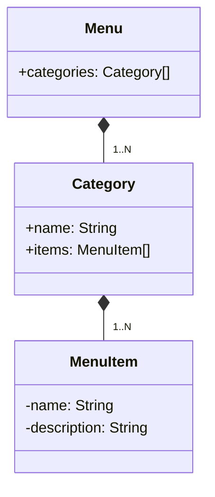

# api-dio-challenge
Java RESTful API created for DIO challenge

## Classes Diagram

```mermaid
classDiagram
  class Menu {
    +categories: Category[]
  }
  class Category {
    +name: String
    +items: MenuItem[]
  }
  class MenuItem {
    -name: String
    -description: String
  }

  Menu *-- "1..N" Category
  Category *-- "1..N" MenuItem
```
